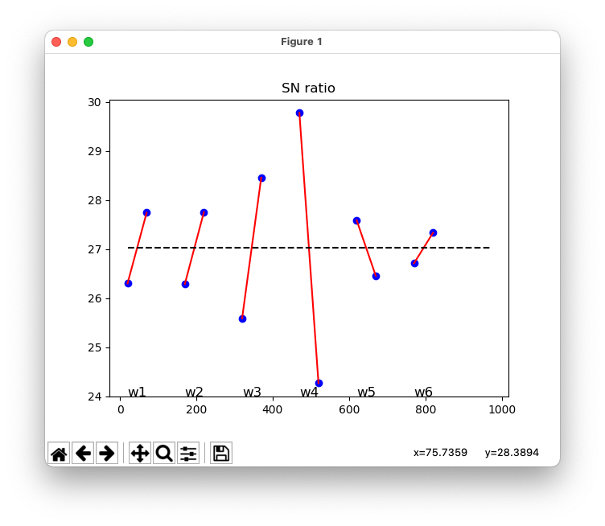
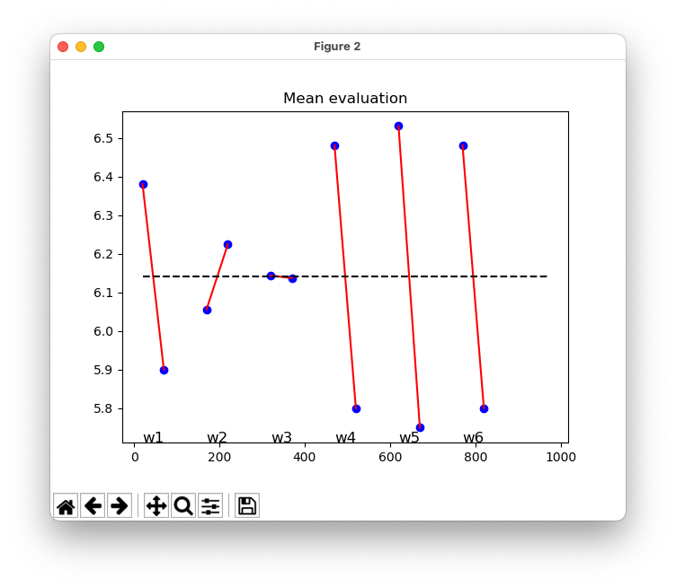

# 実験計画法とタグチメソッド

## /anova
1元配置法および2元配置法による分散分析（多重比較法による水準内の検定も実装）


```
$ python anova.py washing_two.csv
Running two-way ANOVA
********************************
Result of ANOVA: washing_two.csv
********************************
Significant difference among A (p=0.01)
 A1 and A2 have a significant difference (p=0.01).
 A1 and A3 have a significant difference (p=0.01).
 A2 and A3 don't have a significant difference.
Significant difference among B (p=0.01)
 B1 and B2 have a significant difference (p=0.01).
 B1 and B3 have a significant difference (p=0.01).
 B2 and B3 don't have a significant difference.
No significant difference among interaction AxB
```


## /orthogonal_table
直交表を用いた実験計画法による分析。（多重比較法による水準内の検定も実装）

### 繰り返しのない直交表-実験計画法
```
$ python orthogonal.py buhin2.csv
There is no significant effect by A.
There is a significant effect by B (p=0.01).
There is no significant effect by C.
There is no significant effect by D.
There is a significant effect by AB (p=0.05).
```
### 繰り返しのある直交表-実験計画法（完全無作為法）（cf. 乱塊法）
```
$ python orthogonal_repetition.py poster_repetition.csv
There is a significant effect by A (p=0.01).
There is a significant effect by B (p=0.01).
There is no significant effect by C.
There is a significant effect by D (p=0.05).
There is no significant effect by AB.
There is no significant effect by AC.
There is no significant effect by e_prime.

```

## /mahalanobis_taguchi
マハラノビス-田口法による正常値/異常値の識別。

以下のプログラムでは既存のデータの組から、新規に与えられたデータ（wおよびx）がどちらのグループに属するか判定する。

```
**************************
Mahalanobis-Taguchi method
**************************
W is healthy
X is not healthy
```


## /taguchi
タグチメソッドによるパラメータ最適化。

直交表実験計画法による計算から要因効果図を図示し、重回帰分析によりパラメータの最適値を求める。
```
$ python taguchi.py
**********************
Optimal solution
**********************
X1    1.000000
X2    0.000000
X3    1.000000
X4    1.000000
X5    1.000000
X6    1.000000
Y     7.540625
Name: 47, dtype: float64
```



# 参考文献
例題とExcel演習で学ぶ 実験計画法とタグチメソッド
https://www.amazon.co.jp/dp/4274219666
