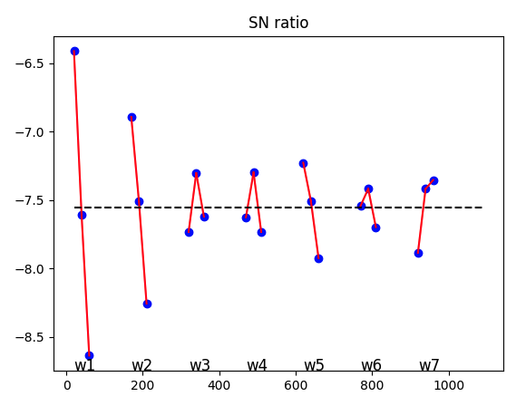
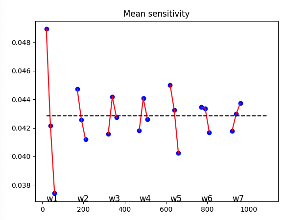

# 動特性のタグチメソッド

ソフトウェアの前提

1. 以下のフォーマットで作成する必要がある。

| x1 | x2 | x3 | x4 | x5 | x6 | x7 | w1:u1 | w1:u2   | w2:u1 | w2:u2  |
| -- | -- | -- | -- | -- | -- | -- | ----- | ------- | ----- | ------ |
| 1  | 1  | 1  | 1  | 1  | 1  | 1  | 15.93 | \-10.84 | 25.4  | \-6.66 |
| 1  | 2  | 2  | 2  | 2  | 2  | 2  | 16.61 | \-12.59 | 24.92 | \-4.57 |
| 1  | 3  | 3  | 3  | 3  | 3  | 3  | 17.32 | \-13.96 | 24.04 | \-7.24 |
| 2  | 1  | 1  | 2  | 2  | 3  | 3  | 15.72 | \-12.17 | 22.82 | \-5.06 |
| 2  | 2  | 2  | 3  | 3  | 1  | 2  | 16.37 | \-13.2  | 22.71 | \-6.86 |
| 2  | 3  | 3  | 1  | 1  | 2  | 1  | 16.88 | \-13.44 | 23.77 | \-6.56 |
| 3  | 1  | 2  | 1  | 3  | 2  | 3  | 15.38 | \-12.26 | 21.6  | \-6.04 |
| 3  | 2  | 3  | 2  | 1  | 3  | 1  | 16.4  | \-13.35 | 22.51 | \-7.24 |
| 3  | 3  | 1  | 3  | 2  | 1  | 2  | 17.01 | \-14.09 | 22.84 | \-8.26 |
| 1  | 1  | 3  | 3  | 2  | 2  | 1  | 16.82 | \-12.57 | 25.32 | \-4.07 |
| 1  | 2  | 1  | 1  | 3  | 3  | 2  | 16.05 | \-12.19 | 23.02 | \-4.44 |
| 1  | 3  | 2  | 2  | 1  | 1  | 3  | 17.21 | \-12.94 | 27.23 | \-4.4  |
| 2  | 1  | 2  | 3  | 1  | 3  | 2  | 16.43 | \-12.61 | 24.07 | \-4.97 |
| 2  | 2  | 3  | 1  | 2  | 1  | 3  | 16.55 | \-13.06 | 23.51 | \-6.09 |
| 2  | 3  | 1  | 2  | 3  | 2  | 1  | 16.58 | \-13.57 | 22.59 | \-7.56 |
| 3  | 1  | 3  | 2  | 3  | 1  | 2  | 15.82 | \-12.66 | 22.17 | \-6.3  |
| 3  | 2  | 1  | 3  | 1  | 2  | 3  | 16.48 | \-13.29 | 22.85 | \-6.93 |
| 3  | 3  | 2  | 1  | 2  | 3  | 1  | 16.36 | \-13.63 | 21.83 | \-8.16 |

すなわち、制御因子はxで始まり、誤差因子はwで始まり、信号因子はuで始まる。
誤差因子wと信号因子uはw1:u1のように、コロンで区切る。

2. 制御因子は3水準、すなわち1と2と3から成る。

